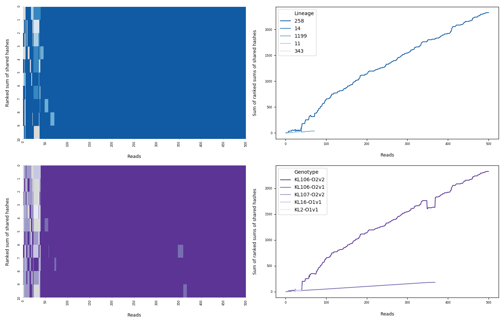

# sketchy <a href='https://github.com/esteinig'></a>


Real-time lineage matching and genotyping from uncorrected nanopore reads

### Overview

**`v0.3.a9: public test build, conda install`**

`Sketchy` is an online lineage matching algorithm for real-time genotyping and susceptibility prediction in bacterial pathogens using nanopore sequencing platforms. Currently supported species are *Staphylococcus aureus*,  *Klebsiella pneumoniae* and *Mycobacterium tuberculosis*.

### Install
---

:snake: `conda install -c bioconda -c esteinig sketchy`

Pull sketch databases into local storage before first use:

`sketchy db-pull`

Local sketches can be viewed with:

`sketchy db-list`

### Usage
---

#### :briefcase: `sketchy predict`

Main interface for prediction on uncorrected nanopore reads. 

`sketchy predict --help`

Default sketches (`-s`) available:

| Pathogen | Genomes | K-mer size | Sketch size | `-s` |
|  :---   |  :---:  |  :---:  |  :---:  |  :---:  |
| *Staphylococcus aureus* | 38,948  | 15  |  1000  |  `mrsa` |
| *Klebsiella pneumoniae* | 12,765  | 15  |  1000  |  `kleb` |
| *Mycobacterium tuberculosis* | 27,876  | 15  |  1000  | `tb` |

Completed test sequence read file (`test/test.fq`) - predict on first 1000 reads (default) and compute the sum of shared hashes post-hoc, 8 processors, using the *K. pneumoniae* sketch:

`sketchy predict -f test/test.fq -s kleb -t 8`

This produces the data file `sketchy.tsv` which is the input for `sketchy plot`

---

#### :eyeglasses: `sketchy plot`

`sketchy plot --help`

Sketchy plot handles the raw output from the prediction and generates a ranked hitmap (by top ranking sum of shared hashes) colored by lineage, genotype (`-g`), antimicrobial resistance profiles (`-r`). *K. pneumoniae* does currently not support resistance profiling so this example uses only `--genotype`. Output is a plot in the format (`-f`) such as `sketchy.png` where a limit to the reads shown on the `x-axis` can be pased with `--limit`. 

The plot also shows the total sum of shared hashes aggregated at each read by lineage, or genotype / resistance profile (right), which serves as a means of identifying the most frequent value for the trait (ranked in legend). Colors (`--color`) can be `brewer` palette names such as `PuGn` or a comma delimited list of `brewer` palette names if, for example, genotype (`-g`) is activated.

`sketchy plot -d sketchy.tsv -f png -g --limit 500 --color Blues_r,Purples_r`

<a href='https://github.com/esteinig'></a>

When the breakpoint `-b` option is activated the task attempts to determine a breakpoint on the most frequent trait where the sum of sum of shared hashes (2nd plot) is stable for `--stable` amount of reads. This threshold by default is set to 500, but may need to be adjusted for species like *M. tuberculosis* or can be set conservatively to ensure confidence in predictions. The breakpoint option will also output a file `sketchy.bp.tsv`, which writes the breakpoints to file.

`sketchy plot -d test.tsv -b --stable 500`

This would generate the output file indicating the stable breakpoints in reads and the predicted traits:

```
> head sketchy.bp.tsv

              lineage     genotype       
first         7           1
stable        39          41
prediction    258         KL106-O2v2
```

If the input reads `.fq` are passed to `--time`, the task will attempt to parse timestamps from the `.fq` headers and replace read breakpoints with time breakpoints. Example from a *S. aureus* reference strain on a low-throughput R9.4 pore architecture from 2016:

```
> head sketchy.bpt.tsv

              lineage                 genotype                susceptibility
first         2016-11-27 08:31:55     2016-11-27 08:24:41     2016-11-27 08:23:15
stable        2016-11-27 08:36:29     2016-11-27 09:20:06     2016-11-27 08:31:54
prediction    243                     MSSA:PVL-               SSSSSSSSSSSS
```

---

#### :closed_umbrella: `nextflow sketchy.nf`

Bootstrap workflow in Sketchy. Documentation placeholder.
