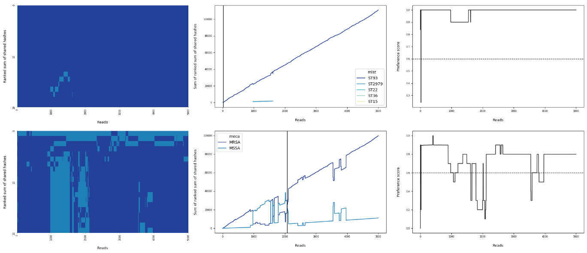
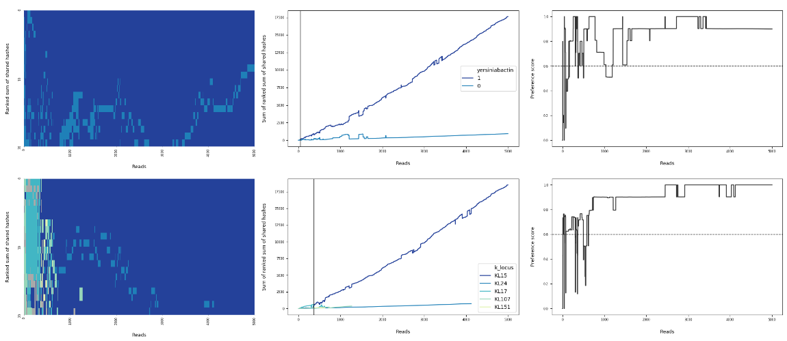
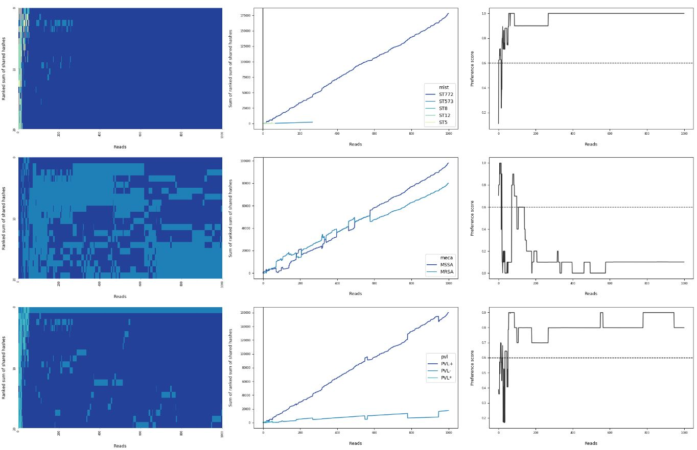
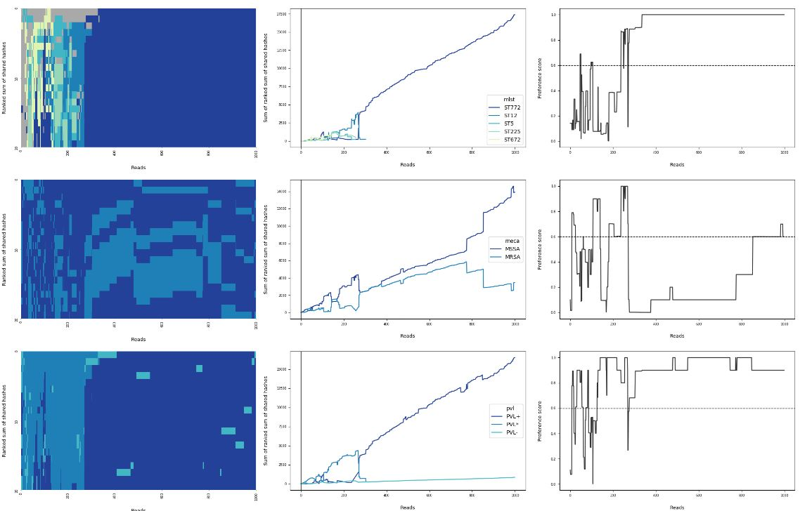

# sketchy <a href='https://github.com/esteinig'></a>


Real-time lineage hashing and genotyping of bacterial pathogens from uncorrected nanopore reads using genomic neighbor typing heuristics with `Mash`

## Overview

**`v0.5.0: preprint`**

`Sketchy` is a lineage calling and genotyping platform based on the heuristic principle of genomic neighbor typing developed by [Karel Břinda and colleagues (2020)](https://www.biorxiv.org/content/10.1101/403204v2). `Sketchy` implements `mash screen` for read sets and an online version of `mash dist` (the sum of shared hashes) for real-time nanopore read streams. It queries species-wide, lineage-resolved reference sketches of bacterial whole genome assemblies and infers their associated genotypes based on the closest reference matches, including multi-locus sequence types, susceptibility profiles, virulence factors or species-specific markers. Precomputed genotype features and  automatically updated databases of species genomes can be found in the corresponding pathogen reference sections. 

Species which we have validated using matching Illumina / ONT sequence data:

* *Staphylococcus aureus* (n = 142)
* *Klebsiella pneumoniae* (n = 120)

Please see our preprint for guidance on the limitations of `Sketchy`.

- [Install](#install)
  - [:new_moon: `singularity`](#singularity)
  - [:rocket: `cargo`](#cargo)
  - [:whale: `docker`](#docker)
  - [:snake: `conda`](#conda)
- [Setup](#setup)
- [Usage](#usage)
  - [Python command line](#python-client)
  - [Nextflow pipeline](#nextflow-pipeline)
  - [Custom sketches](#custom-sketches)
  - [How it works](#how-it-works)
  - [Evaluation outputs](#rust-client)
  - [Rust command line](#rust-client)
  - [Online streaming analysis](#rust-client)
  - [Android mobile phones](#rust-client)
- [Reference sketches](#reference-sketches)
  - [ :closed_umbrella: *Staphylococcus aureus*](#rust-client-tasks)
  - [ :briefcase: *Klebsiella pneumoniae*](#rust-client-tasks)
- [Constructing reference sketches](#reference-sketches)
  - [Genome assemblies and sketch construction](#rust-client-tasks)
  - [Genotype features and index preparation](#rust-client-tasks)
  - [Lineage and local sketches](#rust-client-tasks)
- [Tasks and parameters](#tasks)
  - [Rust CLI](#rust-client-tasks)
  - [Python CLI](#python-client-tasks)
- [Citing](#citing)
  - [BioRxiv](#bioarxiv)
  - [BibTeX](#bibtex)

## Install

Sketchy implements a `Rust` command-line interface (`sketchy-rs`) for computation and evaluation on read streams and a `Python` command-line interface (`sketchy`) for evaluation plots and database utilities.

#### `Singularity`

I prefer `Singularity` for integrated access to host sytem files. The container is preloaded with default reference sketches and the container environment variable `$SKETCHY_PATH` is set to their internal location at `/sketchy`

```sh
singularity pull docker://esteinig/sketchy:latest
./sketchy_latest.sif list
```

#### `Cargo`

`Rust` client only where the `compute` subtask requires `Mash` in host `$PATH`

```bash
cargo install sketchy-rs
```

On Linux systems one should be able to install `Mash` conveniently e.g.

```bash
sudo apt-get install mash
```

#### `Docker`

`Docker` image is available, also comes preloaded with the default reference sketches

```sh
docker pull esteinig/sketchy:latest
```

#### `Conda`

`Sketchy` is available on `BioConda` (thanks to [@mbhall88](https://github.com/mbhall88))

```
conda install -c bioconda -c conda-forge sketchy=0.4.5
```

You can also manually install into an environment like this:

```sh
conda install -c bioconda -c conda-forge \
  mash=2.2 psutil pysam rust nanoq
cargo install sketchy-rs
git clone https://github.com/esteinig/sketchy
pip install ./sketchy
sketchy pull
sketchy list
```

## Reference sketches

If no container is used, pull default species sketches into local storage before first use:

```
sketchy pull
```

You can set the path to which the sketches are downloaded e.g. to the default `--path ~/.sketchy`. Use the `--full` flag to pull the complete, high-resolution collections (~ 2 GB):

```
sketchy pull --path ~/.sketchy --full
```
Local sketches and template names can be viewed with:

```
sketchy list
```

Set the environment variable `$SKETCHY_PATH` to a custom sketch directory for the `sketchy list` and `sketchy run` tasks to discover databases automatically.

## Sketchy usage

See the `Tasks and Parameters` section for details on all tasks and settings available in `Sketchy`. Reads are expected to belong to the species of the selected reference sketch. For an evaluation of genomic neighbor typing using `mash screen` and a comparison to the online implemention of `mash dist` on comprehensive and dereplicated strain-level sketches, please see the preprint. Setup with `sketchy pull` deposited the default sketches to `~/.sketchy` so we can set the environment variable `SP` for convenience access to sketch files:
 
```bash
SK=~/.sketchy
```

### Screening function

`Sketchy` primarily uses a screening of the reference sketch containment in the provided read set as implemented by `Mash`. I tend to use this function for quick and easy genomic neighbor type screening on many isolates, unless few reads are available (< 200). Screening with `Mash` uses the winner-takes-all strategy and `Sketchy` then simply links the best match with the genotype data provided with the reference sketches. 

In the `Python client`:

```
sketchy screen --fastx test.fastq --sketch saureus --limit 10 --pretty
```

In the `Rust client` directly:

```
sketchy-rs -f test.fastq -s $SK/saureus.msh -g $SK/saureus.tsv -l 10 -p
```

Please cite the following when you use `sketchy screen`:

* Ondov et al. (2016) - `Mash`
* Ondov et al. (2019) - `Mash Screen`

### Streaming function

Streaming genomic neighbor typing heuristic that implements `mash dist`, the sum of shared hashes and reference sketches with `Mash`. Because streaming is slower than screening for completed sequence runs, I tend to use this more in cases where extremely few reads are available (< 100) or when streaming is actually required (not that often). However, in some edge cases the streaming utility can be quite useful - for instance, while preference scores were low, we confirmed a cystic fibrosis *S. aureus* re-infection and some barcoded isolates from < 10 reads, which was not possible with the `screen` utility.

`Sketchy's` streaming utility can be run through a wrapper in the `Python client` which is only suitable for completed read files. Read streams and online sequencing runs should be served with the `Rust CLI` (see below). 

```bash
sketchy run --help
```

Streaming is primarily bottlenecked by sketch queries of each read against the reference sketch, which means that prediction speeds are sufficiently fast for online predictions on smaller sketches (e.g. 10,000 genomes, ~ 100 reads/second) but for large sketches and analyses over tens of thousands of reads, total runtime can be excruciating. Fortunately, we generally do not need that many reads to make predictions. When using species-wise reference sketches with tens of thousands of genomes on large read sets use `head` or `--limit` options in the command line clients to predict on the first few thousands reads (`sketchy run --limit 3000` or `cat test.fq | head -12000 | sketchy-rs compute`) which should be sufficient for initial analysis. Smaller reference sketches by lineage or created from local collections should be sufficiently fast for online prediction on MinION / Flongle / GridION.

When using a template, execution looks like this:

```bash
sketchy run --fastq test.fq --sketch saureus
```

Parameter `--ranks` controls the width of the consensus window for feature aggregation over the top ranking hits against the reference sketch (rows in heatmap diagnostic output)

```bash
sketchy run --fastq test.fq --sketch saureus --ranks 10 --limit 1000
```

More options can be viewed with

```bash
sketchy run --help
```

The `Rust` command line interface implements two subtasks: `sketchy-rs compute` (ssh, raw hit sums as in heatmap output) and `sketchy-rs evaluate` (sssh, ranked sums of shared hashes by feature, as in line plot output). Both read from `/dev/stdin` and can be piped. 
 
`Compute` internally calls `mash dist` and processes the output stream by computing the sum of shared hashes. If heatmaps should be included in the evaluations, the output should be directed to a file, e.g.
 
 ```bash
 cat test.fq | head -20000 | \
 sketchy-rs compute \
    --sketch $SK/saureus.msh \
    --ranks 20 \
    --progress 1 \
    --threads 4 \
 > test.ssh.tsv
 ```
 
`Evaluate` then computes the sum of ranked sums of shared hashes, and other summaries for plotting:

```bash
cat test.ssh.tsv | \
sketchy-rs evaluate \
    --features $SK/saureus.tsv \
    --stable 1000 \
> test.sssh.tsv
```

The `Rust` pipeline can be executed in one step, such as:

```bash
cat test.fq | head -20000 \
| sketchy-rs compute \
    --sketch $SK/saureus.msh \
    --ranks 20 \
    --progress 1 \
    --threads 4 \
| sketchy-rs evaluate \
    --features $SK/saureus.tsv \
    --stable 1000 \
> test.sssh.tsv
```

Diagnostic plots and evaluation summaries are handled in the `Python CLI` and accessed via the `sketchy plot` task:

```
sketchy plot \
    --sssh test.sssh.tsv \
    --ssh test.ssh.tsv \
    --index $SKETCHY_PATH/saureus.tsv \
    --key $SKETCHY_PATH/saureus.json \
    --stable 1000 \
    --palette YnGnBu \
    --prefix test \
    --format png
```

Please cite the following when you use `sketchy stream`:

* Ondov et al. (2016) - `Mash`

### Online streaming analysis

In a live sequencing run, `Sketchy` can be set to observe a directory (e.g. `fastq_pass` from live basecalling) in order to stream reads into the `Rust CLI`. A watcher waits for the `fastq` file to be completed before piping the filename to `/dev/stdout` and the reads into the `Rust CLI:

```
sketchy online watch -d /path/to/live/fastq | cat - \
| sketchy-rs compute \
    --sketch $SKETCHY_PATH/saureus.msh \
    --ranks 20 \
    --progress 1 \
    --threads 4 \
| sketchy-rs evaluate \
    --features $SKETCHY_PATH/saureus.tsv \
    --stable 1000 \
> test.sssh.tsv
```

### Android mobile phones

To set up the `Rust CLI` on Android mobile phones, the following can be done in a couple of minutes:

1. Install the [`UserLAnd`](https://github.com/CypherpunkArmory/UserLAnd) app 
2. Setup an `Ubuntu` image
3. Run the following in the terminal

```bash
sudo apt-get update && sudo apt-get install curl mash build-essential

curl --proto '=https' --tlsv1.2 -sSf https://sh.rustup.rs | sh
cargo install sketchy-rs

wget https://storage.googleapis.com/sketchy-sketch/saureus.min.tar.gz \
  && tar -xvzf saureus.min.tar.gz
wget https://storage.googleapis.com/sketchy-sketch/mobile_test.fq

cat mobile_test.fq | \
sketchy-rs compute \
   --sketch saureus_15_1000.msh \
   --ranks 10 \
   --progress 0 \
   --threads 1
```

Python CLI has not been tested.


### Nextflow pipeline

TBD.
 
## Reference sketches

Species-wide reference sketches are available for *S. aureus* and *K. pneumoniae*. 

PE Illumina data from ENA were collected with `pathfinder survey` and run through the `pf-core/pf-survey` pipeline: QC -> species typing with `Kraken2` -> `Skesa` assembly with `Shovill` -> genotyping with `Kleborate`, `SCCion`, `Mykrobe`. Final data was fiiltered and prepared into genotype reference indices and assemblies were used to build reference sketches with `Mash`. 

Sketch names are addressable in the `sketchy run` function and are constructed in the pattern `prefix_{kmer}_{size}`. Prediction ability is not uniform across genotype features, and it is strongly suggested to validate on nanopore reference collections (hybrid assemblies, phenotypes if included). We provide data on validation sets for *S. aureus* and *K. pneumoniae* but lack nanopore data for appropriate validation of other species. If you have such data and are interested in making it available for us to create and validate reference sketches for other pathogens, please let us know.

### :closed_umbrella: Staphylococcus aureus

*S. aureus* sketches will likely be dereplicated in the preprint release to increase speed of predictions. 

Example:

<a href='https://github.com/esteinig'></a>

* 38893 genomes from the Euopean Nucleotide Archive
* 1045 sequence types (MLST)
* 12 antibiotic susceptibilities

Default collection:

* `saureus_15_1000` (default) - 159 MB
* `saureus_15_10000` (full) - 1.5 GB

Genotype features from assemblies with `SCCion`:

* MLST
* SCC*mec* type
* Panton Valentine leukocidin (PVL)
* *mecA* gene (MSSA/MRSA)

 Mykrobe susceptibility phenotypes:
 
* Clindamycin
* Rifampicin
* Ciprofloxacin
* Vancomycin
* Tetracycline
* Mupirocin
* Gentamicin
* Trimethoprim
* Penicillin
* Methicillin
* Erythromycin
* FusidicAcid

### :briefcase: Klebsiella pneumoniae

*K. pneumoniae* sketches are from a relatively small collection of less than ten thousand genomes and may be extended in future releases.

Example:

<a href='https://github.com/esteinig'></a>

* 8149 genomes from the European Nucleotide Archive
* 626 sequence types
* 16 antimicrobial resistance genes

Default collection:

* `kpneumoniae_15_1000` (default) - 34 MB
* `kpneumoniae_15_10000` (full) - 313 MB

Genotype features from assemblies with `Kleborate`:

* MLST
* Virulence score
* Resistance score
* Yersiniabactin
* Hypermucoidy
* K-locus serotype
* O-locus serotype

Resistance genes from assemblies with `Kleborate`, presence or absence:

* AGly (aminoglycosides)
* Bla (beta-lactamases)
* Bla_broad (broad spectrum beta-lactamases)
* Bla_Carb (carbapenemase)
* Bla_ESBL (extended spectrum beta-lactamases)
* Fcyn (fosfomycin)
* Flq (fluoroquinolones)
* Gly (glycopeptides)
* MLS (macrolides)
* Ntmdz (nitroimidazole, e.g. metronidazole)
* Phe (phenicols)
* Rif (rifampin)
* Sul (sulfonamides)
* Tet (tetracyclines)
* Tmt (trimethoprim)
* Tgc (tigecycline)

## Constructing reference sketches

Reference sketches can be constructed and prepared for use with `Sketchy`. Custom sketches are useful for prediction on species currently not offered in the default collection, lineage sub-sketches of a species, or local genome collections, such as from  healthcare providers or surveillance programs that are not publicly accessible. All that is required is a set of high-quality assemblies and their associated genotypes. Ultimately, genome and feature representation in the database should be considered carefully, as they define the genomic neighbors that can be typed with `Sketchy`. 

Custom sketches must include a:

* reference sketch
* numeric genotype index
* genotype key file 

with the same file names and the following extensions, such that:

```bash
ref.msh   # sketch
ref.tsv   # index
ref.json  # key 
```

Custom collections can be used with reference to the path and file name in the `--sketch` option:

```bash
sketchy run --fastq test.fq --sketch ref
```

### Genome assemblies and sketch construction

Assemblies should be of sufficient quality for genotyping and can produced for example with tools from the [`Torstyverse`](https://github.com/tseemann) like [`Shovill`](https://github.com/tseemann/shovill) or with large-scale public archive surveillance pipelines like [`Pathfinder`](https://github.com/pf-core). 

Given a set of high-quality assemblies in the current directory:

```
DRR083589.fasta
DRR083590.fasta
DRR119226.fasta
DRR119227.fasta
DRR128207.fasta
DRR128208.fasta
```

`Mash` can be used directly to construct the sketch with the following default parameters:

```
mash sketch -s 1000 -k 15 -o ref *.fasta
```

See the [`Nextflow`](#nextflow) section for parallel sketch building and the [`Benchmarks`](#benchmarks) section for guidance on selecting an appropriate sketch and k-mer size for `Sketchy`. 

### Genotype features and index preparation

Genotypes associated with each genome in the reference sketch should be in a tab-delimited table (e.g. `genotypes.tsv`) with appropriate headers. Here the `uuid` column is used to demonstrate that the index **must be in the same order as genomes in the sketch**. We will remove the `uuid` column in the next step when we translate columns into categorical data - which does not make sense for `uuid`.

```
uuid        st      sccmec  pvl 
DRR083589   st772   v       +
DRR083590   st93    iv      +
DRR119226   st59    v       +
DRR119227   st80    iv      +
DRR128207   st772   -       +
DRR128208   st90    iv      +
```

To generate the three reference sketch files use `sketchy feature prepare`:

```
sketchy feature prepare -i genotypes.tsv --drop uuid --prefix ref
```

together with the `.msh` sketch created above, the final files for use in prediction are:

```
ref.msh   # sketch
ref.tsv   # index
ref.json  # key 
```

See here [how to use custom reference sketches](#custom-sketches) in `sketchy run`.


### How the online algorithm works: `sketchy stream`

`Sketchy` computes two simple scores: the first is the sum of shared hashes, where it keeps a cumulative sum of shared hashes (`ssh`) computed against each index in the reference sketch for each consecutive read. This takes the majority of compute in the `Mash` queries while `Sketchy` siphons off the output which is why it is so frugal to run. At each read, the indexed scores are ranked and the highest ranking scores are recorded (default `--ranks 20`) to reduce excessive read-wise output of the reference sketch queries.

In the second stage, an evaluation score is computed by aggregating the sum of ranked sum of shared hashes (`sssh`) for each genotype feature in the associated genotype index that a prediction is made on (e.g. SCC*mec* type or susceptibility to an antibiotic). Final predictions are made on the highest total `sssh` scores which correspond to the dominant feature value in the `sssh` scores of each feature. 

Evaluations are plotted for visual confirmation, along with a preference score adopted from [Brinda and colleagues](https://www.biorxiv.org/content/10.1101/403204v2) that indicates the degree of confidence in the best prediction over the second-best prediction.

### Sketchy evaluation outputs

Sketchy produces a directory `--output` with the intermediary pipeline data files (`prefix.ssh.tsv` and `prefix.sssh.tsv`). For evaluation and prediction output, the primary data file is `prefix.data.tsv` which shows the final prediction for each genomic feature, the determined stability breakpoints in reads (`0` or `-1` in < v0.4.4 means that a breakpoint could not be called either because predictions were not stable or the chosen stable breakpoint was smaller than the evaluated reads) and the median preference score over the evaluated reads:

```
feature         prediction      stability       preference
mlst            ST93            23              0.66666667
meca            MRSA            17              0.39714868
pvl             PVL+            23              1.0
scc             SCCmec-IV       23              0.39745917
clindamycin     S               1               0.80033841
rifampicin      S               1               1.0
ciprofloxacin   S               1               1.0
vancomycin      S               1               1.0
tetracycline    S               2               1.0
```

Debugging plots for evaluation are the more salient outputs - the following images show a different sample prediction than the outputs above. Each row in the image corresponds to one genomic feature prediction, which is listed in the middle legend together with the top five alternative feature value predictions. Each feature value prediction corresponds to a color, where darker colors represent the highest-ranking and therefore most likely predictions.

<a href='https://github.com/esteinig'></a>

**What's going on here?**

In the heatmap, the highest-ranking (descending) raw sum of shared hashes queries against the database sketch are shown and colored. Gray colors represent feature values not in the ultimate highest-ranking five and demonstrate uncertainty in the initial predictions. On the other hand, homogenous color represents certainty in the prediction which may increase as the scores are updated.

In the middle plot, the ranked sum of shared hashes (`ssh`) are evaluated by aggregating the sum of their ranked sum of shared hashes (`sssh`) by feature value, from which stability breakpoints are calculated (vertical lines) i.e. where the highest scoring feature value remains the highest scoring for `--stable` reads. In the example this defaults to 1000 reads, so no breakpoints were detected (set to `0`) as the prediction was limited to 1000 reads total; breakpoints are included in the `prefix.data.tsv` output file. Legend items and colors are ordered according to rank; a straight, uncontested line for a dominant feature value score indicates certainty the same as homogenous color in the heatmap.

In the plot on the right, the preference score from [Brinda and colleagues](https://www.biorxiv.org/content/10.1101/403204v2) is computed on the sum of ranked sums of shared hashes (`sssh`) scores from the middle plot. As in the original a threshold of `p = 0.6` (horizontal line) indicates when a prediction should be trusted and when it should not. Note that the preference is always computed on the feature value with the highest score over the feature value with the second highest score, regardless of whether it is the right prediction. In fact, the score is susceptible to 'switches' in predictions, especially using lower resolution sketches, where a prediction is updated and flips to another more likely prediction as more evidence is gathered. 

<a href='https://github.com/esteinig'></a>

In this example, the same data from the Bengal Bay clone is run on the lower resolution reference sketch `saureus_15_1000` instead of `saureus_15_10000`. Incorrect sequence type ST12 is called for about 300 reads before making a switch to the correct sequence type ST772. This is reflected in the heatmap by distinct color blocks, but lower-resolution also trades-off prediction speed with larger more accurate sketches. In the higher resolution sketch above, the sequence type is called almost immediately and initial uncertainty is lower, as indicated by less gray coloring in the heatmap on the initial reference sketch queries.
